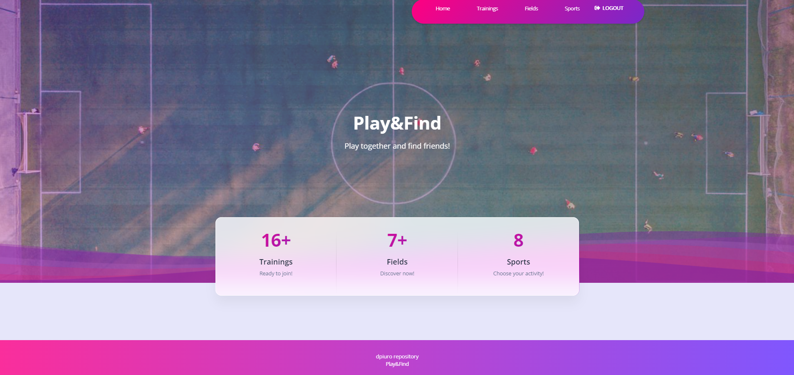

# Play-Find

Welcome to Play&Find, the place where you can find teammates and friends!

Play&Find is a platform that helps users find sports fields and organize games.
Users can create, join, and manage sports training sessions.

Enjoy using!

https://play-find.onrender.com/


You can use the test user provided below, or feel free to register on your own.

```username: username```

```password: password589243```


## Setup Instructions:

1. **Clone the repository**:
    ```bash
    git clone https://github.com/dpiuro/play-find.git
    cd play-find
    ```

2. **Create and activate virtual environment**

    ```bash
    python -m venv venv
    ```

    **For Unix system**:
    ```bash
    source venv/bin/activate
    ```

    **For Windows system**:
    ```bash
    venv\Scripts\activate
    ```

3. **Install the dependencies**:
    ```bash
    pip install -r requirements.txt
    ```

4. **Run migrations**:
    ```bash
    python manage.py migrate
    ```

5. **Create a regular user(or you can skip this step and sign up using site form)**:

    Use the following commands in the Django shell to create a regular user:

    ```bash
    python manage.py shell
    ```

    Inside the shell:

    ```python
    from django.contrib.auth.models import User
    user = User.objects.create_user('user', 'user@example.com', 'password85795495')
    user.save()
    exit()
    ```

    _This will create a user with the following credentials:_
    - Username: `user`
    - Email: `user@example.com`
    - Password: `password85795495`

6. **Start the development server**:
    ```bash
    python manage.py runserver
    ```

7. **Load initial data (optional)**:
    ```bash
    python manage.py loaddata data.json
    ```



